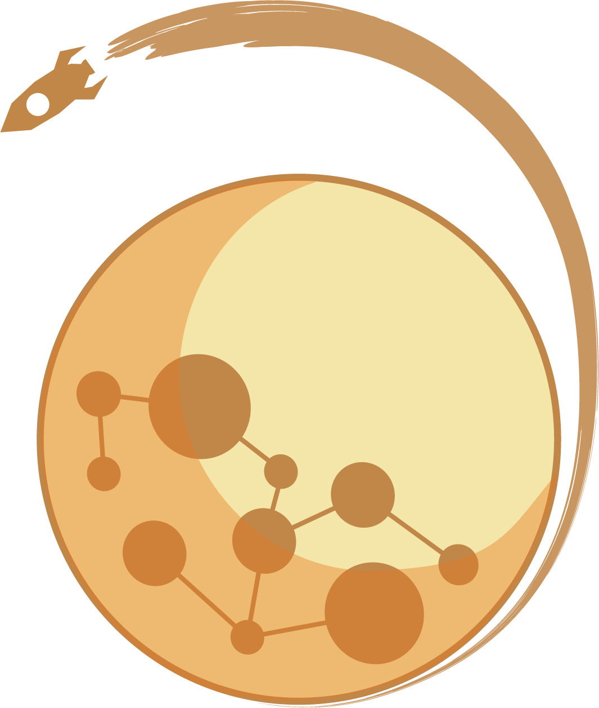
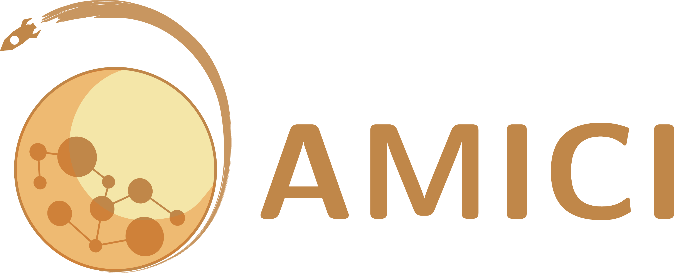

#  AMICI - Advanced Multilanguage Interface for CVODES and IDAS 

## About 

AMICI provides a multi-language (Python, C++, Matlab) interface for the
[SUNDIALS](https://computing.llnl.gov/projects/sundials/) solvers
[CVODES](https://computing.llnl.gov/projects/sundials/cvodes)
(for ordinary differential equations) and
[IDAS](https://computing.llnl.gov/projects/sundials/idas)
(for algebraic differential equations). AMICI allows the user to read
differential equation models specified as [SBML](http://sbml.org/)
or [PySB](http://pysb.org/)
and automatically compiles such models into `.mex` simulation files
(Matlab), C++ executables or Python modules.

In contrast to the (no longer maintained)
[sundialsTB](https://computing.llnl.gov/projects/sundials/sundials-software)
Matlab interface, all necessary functions are transformed into native
C++ code, which allows for a significantly faster simulation.

Beyond forward integration, the compiled simulation file also allows for
forward sensitivity analysis, steady state sensitivity analysis and
adjoint sensitivity analysis for likelihood-based output functions.

The interface was designed to provide routines for efficient gradient
computation in parameter estimation of biochemical reaction models but
it is also applicable to a wider range of differential equation
constrained optimization problems.

## Features

* SBML import (see details below)
* PySB import
* Generation of C++ code for model simulation and sensitivity
  computation
* Access to and high customizability of CVODES and IDAS solver
* Python, C++, Matlab interface
* Sensitivity analysis
  * forward
  * steady state
  * adjoint
  * first- and second-order
* Pre-equilibration and pre-simulation conditions
* Support for
  [discrete events and logical operations](https://academic.oup.com/bioinformatics/article/33/7/1049/2769435)
  (Matlab-only)

## Interfaces & workflow

The AMICI workflow starts with importing a model from either
[SBML](http://sbml.org/) (Matlab, Python) or a Matlab definition of the
model (Matlab-only). From this input, all equations for model simulation
are derived symbolically and C++ code is generated. This code is then
compiled into a C++ library, a Python module, or a Matlab `.mex` file and
is then used for model simulation.

## Getting started

The AMICI source code is available at https://github.com/ICB-DCM/AMICI/.
To install AMICI, first read the
[installation instructions](http://icb-dcm.github.io/AMICI/md__i_n_s_t_a_l_l.html).

To get you started with Python-AMICI, the best way might be checking out this
[Jupyter notebook](https://github.com/ICB-DCM/AMICI/blob/master/python/examples/example_steadystate/ExampleSteadystate.ipynb).

To get started with Matlab-AMICI, various examples are available
in [matlab/examples/](https://github.com/ICB-DCM/AMICI/tree/master/matlab/examples).

Comprehensive documentation on installation and usage of AMICI is available
online at [http://icb-dcm.github.io/AMICI/](http://icb-dcm.github.io/AMICI/).

Any [contributions](http://icb-dcm.github.io/AMICI/md__c_o_n_t_r_i_b_u_t_i_n_g.html)
to AMICI are welcome (code, bug reports, suggestions for improvements, ...).

### Getting help

In case of questions or problems with using AMICI, feel free to post an
[issue](https://github.com/ICB-DCM/AMICI/issues) on Github. We are trying to
get back to you quickly.

## Publications

**Citeable DOI for the latest AMICI release:**

There is a list of [publications using AMICI](documentation/references.md).
If you used AMICI in your work, we are happy to include
your project, please let us know via a Github issue.

When using AMICI in your project, please cite
* Fröhlich, F., Kaltenbacher, B., Theis, F. J., & Hasenauer, J. (2017).
  Scalable Parameter Estimation for Genome-Scale Biochemical Reaction Networks.
  Plos Computational Biology, 13(1), e1005331.
  doi:[10.1371/journal.pcbi.1005331](https://doi.org/10.1371/journal.pcbi.1005331)
and/or
* Fröhlich, F., Theis, F. J., Rädler, J. O., & Hasenauer, J. (2017).
  Parameter estimation for dynamical systems with discrete events and logical
  operations. Bioinformatics, 33(7), 1049-1056.
  doi:[10.1093/bioinformatics/btw764](https://doi.org/10.1093/bioinformatics/btw764)

## Status of SBML support in Python-AMICI

Python-AMICI currently passes 500 out of the 1780 (~28%) test cases from
the semantic
[SBML Test Suite](https://github.com/sbmlteam/sbml-test-suite/)
([current status](https://github.com/ICB-DCM/AMICI/actions)).

In addition, we currently plan to add support for the following features
(see corresponding issues for details and progress):

- Events (currently Matlab-only)
- Rate rules
- Algebraic rules
- Species assignment rules
- Compartment assignment rules
- Models without species

contributions are welcome.

However, the following features are unlikely to be supported:

- SBML extensions
- `factorial()`, `ceil()`, `floor()`, due to incompatibility with
  symbolic sensitivity computations
- initial assignments for parameters
- `delay()` due to missing SUNDIALS solver support

In addition to SBML, we also plan to implement support for the [Simulation Experiment Description Markup Language (SED-ML)](https://sed-ml.org/).

## Current build status

