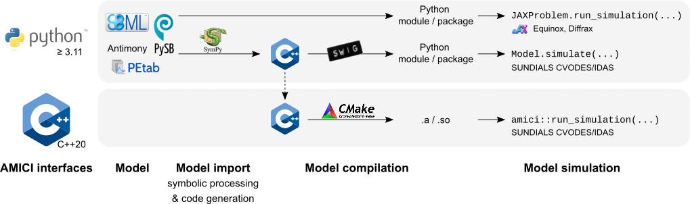

===========
About AMICI
===========

AMICI provides a Python and C++ interface to the
:term:`SUNDIALS` solvers :term:`CVODES` (for :term:`ODE`\ s) and :term:`IDAS`
(for :term:`DAE`\ s). AMICI allows the user to read
differential equation models specified as :term:`SBML` or :term:`PySB`
and automatically compiles such models into Python modules or C++ libraries.
All necessary functions are transformed into native C++ code, which allows for
efficient simulation.

Beyond forward integration, the compiled simulation file also allows for
forward sensitivity analysis, steady state sensitivity analysis and
adjoint sensitivity analysis for likelihood-based output functions.

The interface was designed to provide routines for efficient gradient
computation in parameter estimation of biochemical reaction models but
it is also applicable to a wider range of differential equation
constrained optimization problems.

Features
========

* :term:`SBML` import
* :term:`PySB` import
* Generation of C++ code for model simulation and sensitivity
  computation
* Access to and high customizability of :term:`CVODES` and :term:`IDAS` solver
* Python and C++ interface
* Sensitivity analysis (first-order)

  * forward
  * steady state
  * adjoint

* :term:`Pre-equilibration <pre-equilibration>` and :term:`pre-simulation`
  conditions
* Support for
  `discrete events and logical operations <https://academic.oup.com/bioinformatics/article/33/7/1049/2769435>`_

Interfaces & workflow
======================

The AMICI workflow starts with importing a model from either :term:`SBML`
(Python) or :term:`PySB` (Python).
From this input, all equations for model simulation are derived
symbolically and C++ code is generated. This code is then compiled into a plain
C++ library or a Python module, and is then used for model simulation.

The functionality of the Python and C++ interfaces differ,
as shown in the following table:

.. list-table::
   :header-rows: 1
   :stub-columns: 1

   * - Feature \\ Interface
     - Python
     - C++
   * - :term:`SBML` import
     - yes (:ref:`details <amici_python_sbml_support>`)
     - no
   * - :term:`PySB` import
     - yes
     - no
   * - :term:`DAE` import
     - yes
     - no
   * - Forward sensitivities
     - yes
     - yes
   * - Adjoint sensitivities
     - yes
     - yes
   * - Steadystate sensitivities
     - yes
     - yes
   * - Events
     - yes
     - yes
   * - :term:`pre-equilibration`
     - yes
     - yes
   * - :term:`pre-simulation`
     - yes
     - yes
