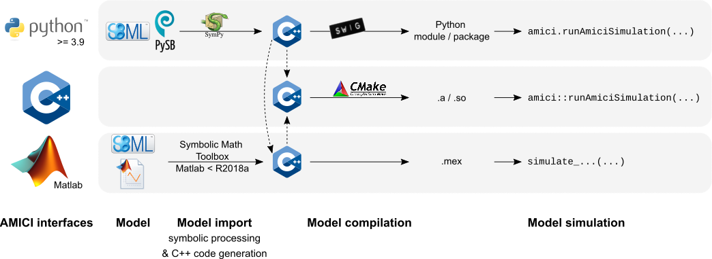

===========
About AMICI
===========

AMICI provides a multi-language (Python, C++, Matlab) interface to the
:term:`SUNDIALS` solvers :term:`CVODES` (for :term:`ODE`\ s) and :term:`IDAS`
(for :term:`DAE`\ s). AMICI allows the user to read
differential equation models specified as :term:`SBML` or :term:`PySB`
and automatically compiles such models into Python modules, C++ libraries or
`.mex` simulation files (Matlab).

In contrast to the (no longer maintained)
`sundialsTB <https://computing.llnl.gov/projects/sundials/sundials-software>`_
Matlab interface, all necessary functions are transformed into native
C++ code, which allows for a significantly faster simulation.

Beyond forward integration, the compiled simulation file also allows for
forward sensitivity analysis, steady state sensitivity analysis and
adjoint sensitivity analysis for likelihood-based output functions.

The interface was designed to provide routines for efficient gradient
computation in parameter estimation of biochemical reaction models but
it is also applicable to a wider range of differential equation
constrained optimization problems.

Features
========

* :term:`SBML` import
* :term:`PySB` import
* Generation of C++ code for model simulation and sensitivity
  computation
* Access to and high customizability of :term:`CVODES` and :term:`IDAS` solver
* Python, C++, Matlab interface
* Sensitivity analysis

  * forward
  * steady state
  * adjoint
  * first- and second-order (second-order Matlab-only)

* Pre-equilibration and pre-simulation conditions
* Support for
  `discrete events and logical operations <https://academic.oup.com/bioinformatics/article/33/7/1049/2769435>`_
  (Matlab-only)

Interfaces & workflow
======================

The AMICI workflow starts with importing a model from either :term:`SBML`
(Matlab, Python), :term:`PySB` (Python), or a Matlab definition of the model
(Matlab-only). From this input, all equations for model simulation are derived
symbolically and C++ code is generated. This code is then compiled into a C++
library, a Python module, or a Matlab `.mex` file and is then used for model
simulation.

